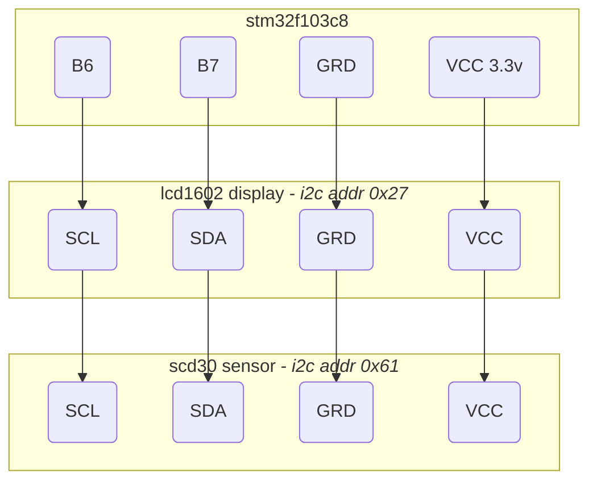

STM32 home sensor STM32F103C8 (blue pill)
=========================================

> Example of home sensor using STM32F103C8 (blue pill) written in Rust. It
> displays temperature, humidity and co2 on a LCD1602 display. Data is pulled
> every 2 seconds from a SCD30 sensor which share the same i2c bus as the
> display.

## Connectivity



## Getting started

```bash
cargo make flash
```

### Debugging

Uncomment hprintln lines in the main.rs, then:
```bash
# build and listen
cargo make openocd

# then debug in another terminal
cargo make debug
(gdb) continue
```

## Datasheet

- [Qapass LCD1602](https://funduino.de/DL/1602LCD.pdf) with [PCF8574T](https://www.ti.com/lit/ds/symlink/pcf8574.pdf) i2c chip
- [SCD30](https://www.sensirion.com/fileadmin/user_upload/customers/sensirion/Dokumente/9.5_CO2/Sensirion_CO2_Sensors_SCD30_Interface_Description.pdf)
